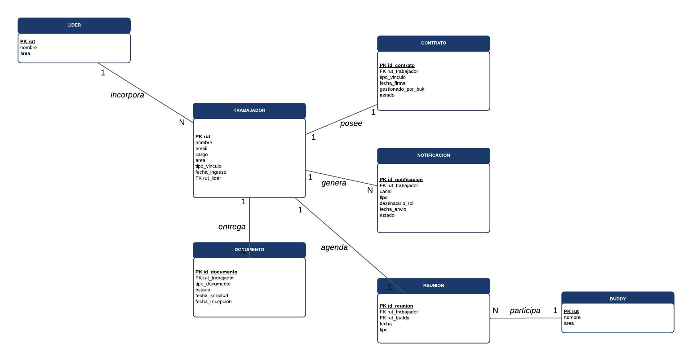

# Modelo de datos preliminar:

El modelo traduce el proceso to-be en una estructura relacional. El criterio de diseño fue que cada acción del proceso tuviera un lugar donde quedar registrada con su fecha y su estado, de manera que el avance de una incorporación pueda reconstruirse consultando la base de datos y no revisando conversaciones. Se compone de siete entidades organizadas en torno a TRABAJADOR.

## Entidades centrales

Se utiliza el RUT como clave primaria natural en las entidades que representan personas, ya que es un identificador único y estable en el contexto chileno.

| Entidad | Atributos principales | PK candidata | Relaciones (cardinalidad) |
|---|---|---|---|
| TRABAJADOR | nombre, email, cargo, area, tipo_vinculo, fecha_ingreso, FK rut_lider | rut | 1:1 con CONTRATO; 1:N con DOCUMENTO; 1:N con NOTIFICACION; 1:1 con REUNION; N:1 con LIDER |
| LIDER | nombre, area | rut | 1:N con TRABAJADOR (incorpora) |
| CONTRATO | FK rut_trabajador, tipo_vinculo, fecha_firma, gestionado_por_buk, estado | id_contrato | 1:1 con TRABAJADOR (posee) |
| DOCUMENTO | FK rut_trabajador, tipo_documento, estado, fecha_solicitud, fecha_recepcion | id_documento | N:1 con TRABAJADOR (entrega) |
| NOTIFICACION | FK rut_trabajador, canal, tipo, destinatario_rol, fecha_envio, estado | id_notificacion | N:1 con TRABAJADOR (genera) |
| REUNION | FK rut_trabajador, FK rut_buddy, fecha, tipo | id_reunion | 1:1 con TRABAJADOR (agenda); N:1 con BUDDY |
| BUDDY | nombre, area | rut | 1:N con REUNION (participa) |

El tipo de vínculo (contratado o practicante), que en el proceso determina una bifurcación, no se modela como entidad aparte sino como atributo de TRABAJADOR y de CONTRATO. Del mismo modo, la generación de accesos y el avance por etapas quedan representados como registros de NOTIFICACION y como los campos de estado y fecha de cada entidad, lo que evita multiplicar tablas que aportarían poca información en esta fase.

## Trazabilidad proceso-datos

Cada una de las siete ramas paralelas del gateway AND del BPMN to-be tiene un lugar definido en el modelo:

- Las cuatro notificaciones informativas (recordatorio al líder, bienvenida por correo, aviso por Slack a RRHH y aviso de bienvenida por Slack) se registran como filas de NOTIFICACION, distinguidas por canal, tipo y destinatario_rol.
- Las dos ramas de agendamiento y la de indicaciones al buddy se sostienen en REUNION, que referencia simultáneamente a TRABAJADOR y a BUDDY.
- La bifurcación entre contratado y practicante queda en CONTRATO, mediante tipo_vinculo y gestionado_por_buk.
- El camino de excepción por documento faltante se apoya en DOCUMENTO y en sus campos de estado y fechas.

Esta correspondencia entre rama del proceso y tabla es justamente lo que hoy falta en YOM, donde el seguimiento vive disperso en un formulario de Google y en una planilla que puede desalinearse con solo modificar una pregunta. Al quedar cada acción registrada con su propia fecha y estado, es posible reconstruir en qué paso se encuentra un trabajador y calcular los indicadores mediante consultas SQL en lugar de revisar planillas a mano.
